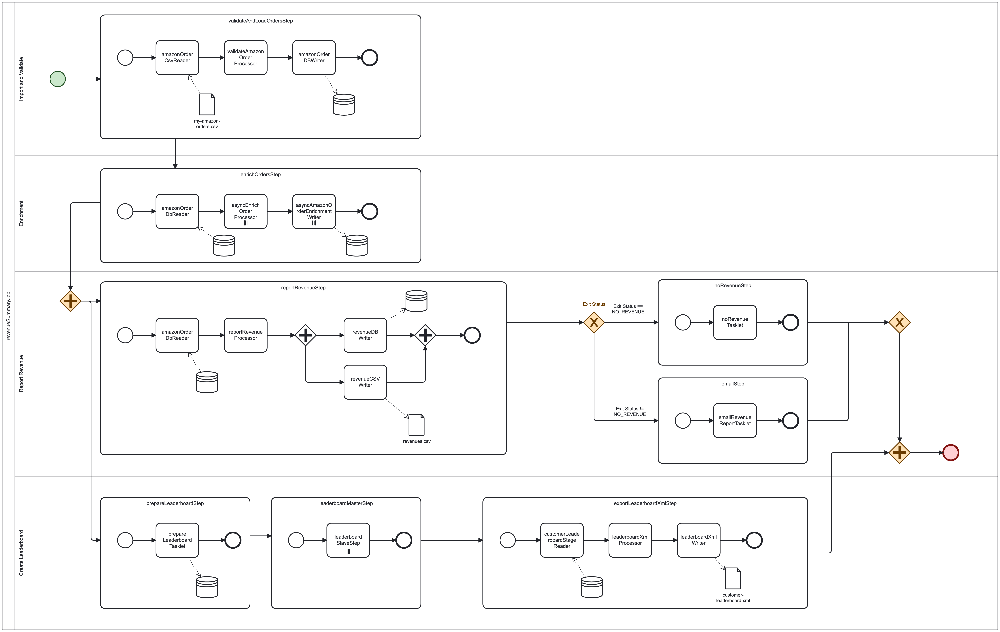

# Customer Invoice Batch Processing

## Überblick
Dieses Projekt entstand im Rahmen meiner Einarbeitung in Spring Batch.
Die Umsetzung sowie die technischen Details erläutere ich gerne näher im Vorstellungsgespräch :-)

Dieses Projekt ist eine Spring-Batch-Anwendung zur Verarbeitung von Bestelldaten.

Die Anwendung demonstriert folgende Konzepte im Bereich Batch-Processing:
- Dateibasierte Datenverarbeitung
- Chunk-orientierte Verarbeitung
- Partitionierung
- Tasklets
- Readers/Processors/Writers inkl. Multi-Threading Verarbeitung
- Listeners
- DTO-Mapping
- Datenbankmigrationen

## Technologien
- Java
- Spring Batch
- Spring Boot (nur um Projekt zu starten)
- Maven
- YAML-Konfiguration
- Flyway Datenbankmigration
- Docker
- H2 Datenbank

## Projektstruktur
```text
src/main/java/com/example/myBatchDemo
│
├── APIs              # Fake REST-Endpunkte
├── Configs           # Spring-Batch-Konfigurationen
├── DTOs              # Data Transfer Objects
├── Listeners         # Step-Listener für Meta-Daten, Logging, Monitoring
├── Mappers           # Mapping-Logik
├── Partitioners      # Parallelisierung / Partitionierung
├── Processors        # Datenverarbeitung
├── Readers           # Daten einlesen
├── Services          # Business-Logik
├── Tasklets          # Tasklet-Schritte
├── Writers           # Daten schreiben
│
├── AmazonOrdersJobConfiguration.java
└── MyBatchDemoApplication.java
```

### Ressourcenstruktur
```text
src/main/resources
│
├── db.migration      # Datenbank-Migrationsskripte
├── input             # Eingabedateien
└── application.yaml  # Anwendungskonfiguration
```
### Batch-Verarbeitungsablauf

Herzstück der Anwendung ist der Batch-Job 
[`AmazonOrdersJobConfiguration`](src/main/java/com/example/myBatchDemo/AmazonOrdersJobConfiguration.java).

#### BPMN Model

Im docs-Ordner befindet sich ein mit Camunda Modeler (Version 7) erstelltes BPMN-Diagramm, das den Ablauf 
des Batch-Jobs visualisiert. Der Fokus liegt dabei auf der Prozesslogik sowie den jeweiligen Input- und Output-Quellen 
der einzelnen Steps.

Das Diagramm enthält:
- den Job und dessen Steps
- Reader
- Processor
- Writer
- Tasklets

Listener wurden bewusst nicht modelliert, da sie primär für Logging, Monitoring und die Ausgabe von Metadaten verwendet werden.



- Die dazugehörige bpmn-Datei befindet sich auch im selben Ordner:
[`revenueSummaryJob.bpmn`](docs/revenueSummaryJob.bpmn)

### Configuration

Die Anwendungskonfiguration befindet hier: [`application.yaml`](src/main/resources/application.yaml)

### Eingabedateien

Die Eingabedateien befinden sich unter: `src/main/resources/input`

#### Hinweis zu den APIs Ordner und JSON-Dateien

Die JSON-Dateien in `/input` dienen als simulierte externe API („Fake API“) für Demo- und Entwicklungszwecke.
Sie werden von [`ProductCatalogLookup.java`](src/main/java/com/example/myBatchDemo/APIs/ProductCatalogLookup.java)
aufgerufen.

### Ausgabedateien

Die generierten Dateien werden im folgenden Verzeichnis gespeichert: `/output`

## Anwendung starten

### Empfehlung: Anwendung mit Docker starten
Ein Dockerfile ist bereits im Projekt beigefügt. Folgende Befehle starten die Anwendung: 

Image bauen:
```bash 
docker build -t my-batch-demo .
```
Container starten:
```bash 
docker run --rm \
  -p 8080:8080 \
  -v "$(pwd)/output:/app/output" \
  my-batch-demo
```

### Alternativ: Anwendung mit MyBatchDemoApplication.java starten

Für die lokale Ausführung werden folgende Komponenten benötigt:
- Java 21 (JDK 21)
- Maven 3.9+ oder alternativ der enthaltene Maven Wrapper `./mvnw`

Danach einfach die Klasse `MyBatchDemoApplication.java` starten.

#### Bereinigung nach jedem Batch-Durchlauf

Spring Batch und Flyway arbeiten mit temporären Daten, Metadaten und Zwischenergebnissen.

Da die Anwendung zusätzlich Daten in eine eingebettete H2-Datenbank schreibt, 
sollten die Datenordner nach jedem Durchlauf bereinigt werden. 
Andernfalls können veraltete Daten oder Batch-Metadaten zu inkonsistentem Verhalten führen.
Beim Löschen des `data`-Ordners wird gleichzeitig auch die eingebettete H2-Datenbankdatei (`testdb.mv.db`) entfernt.

Mit folgendem Befehl werden alte Daten gelöscht und der `data`-Ordner neu erstellt:

```bash 
rm -rf data && mkdir data
```

Wird die Anwendung hingegen über Docker gestartet, muss der `data`-Ordner nicht manuell bereinigt werden, 
da die Daten innerhalb des Containers verwaltet und beim Entfernen des Containers automatisch gelöscht werden.

## Zugriff auf die Einträge der H2-Datenbank

Verwendet wird eine embedded H2-Datenbank. Sie kann lokal durch folgenden Link aufgerufen werden:
http://localhost:8080/h2-console

Im Browser bitte folgende Daten eingeben:
- JDBC URL: `jdbc:h2:file:./data/testdb`
- username: `dataprocessing`
- password: `password`